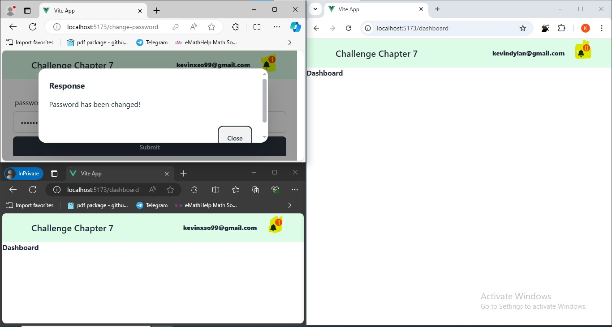
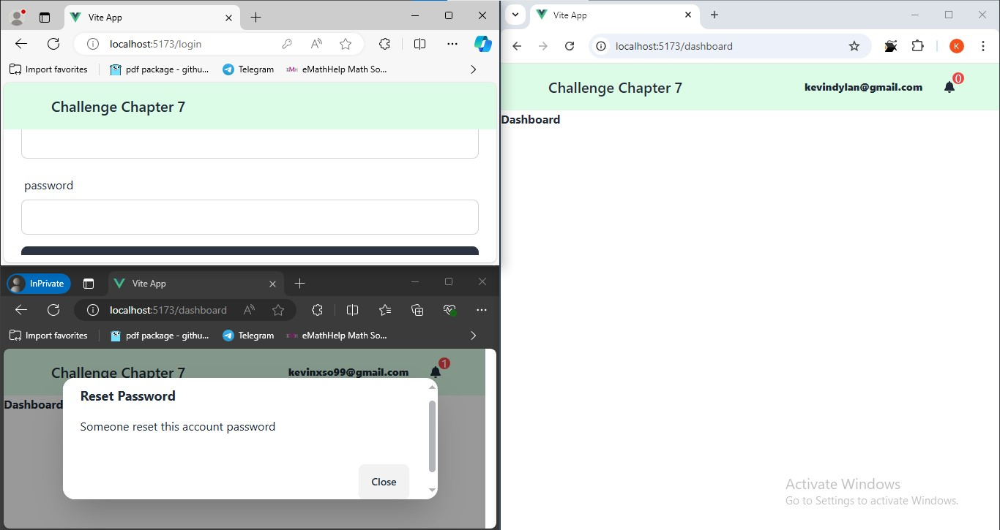

# vue-project

This template should help get you started developing with Vue 3 in Vite.

## Recommended IDE Setup

[VSCode](https://code.visualstudio.com/) + [Volar](https://marketplace.visualstudio.com/items?itemName=Vue.volar) (and disable Vetur).

## Customize configuration

See [Vite Configuration Reference](https://vitejs.dev/config/).

## Project Setup

```sh
npm install
```

### Compile and Hot-Reload for Development

```sh
npm run dev
```

### Compile and Minify for Production

```sh
npm run build
```

## Server Setup
before running server follow instruction below:
1. add .env file and configure these variable in order server work proper
```.env
DATABASE_URL=
SALT_ROUNDS=10
JWT_SECRET=
EMAIL=
PASSWORD=
SENTRY_DSN=
```
2. running this command below:
```sh
cd server && npm i
npx prisma migrate dev --name init
npx @sentry/wizard@latest -i sourcemaps
npm run start:dev
```
Note the yellow markings. If the password is changed, it will only provide notification for the same username, while different accounts will not receive notification.



Notice only same username recieve notification password has changed when someone ask for forgot password and the password has changed and the another account didn't. after get notification account will log out automatically.

